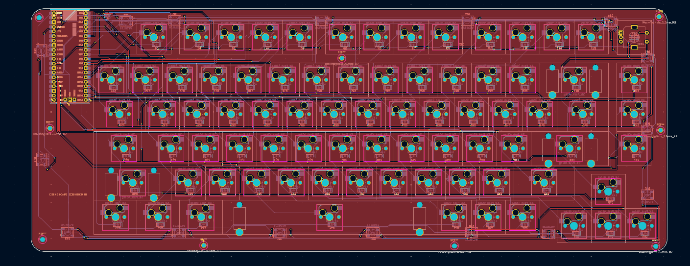
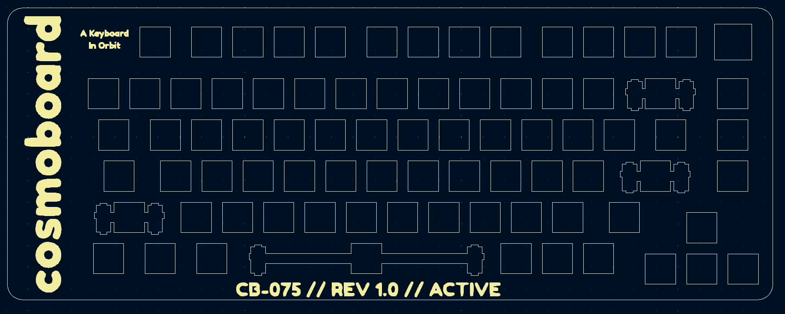
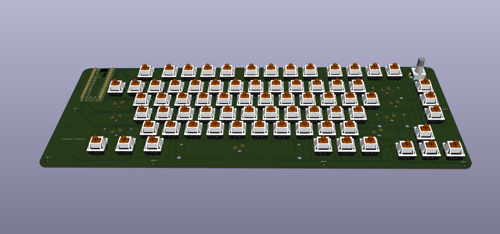

# Cosmoboard

**Cosmoboard** is a custom 75% mechanical keyboard with a floating-switch, open-top design and a cosmic-themed PCB/FR4 plate.

It uses MX switches, MX hot-swap sockets, an FR4 plate, plate-mount stabilizers, one rotary encoder, bottom RGB underglow, and a WeAct RP2350A controller module.

> Type your ideas into orbit, one key at a time.

---

## Gallery

| PCB | Plate | 3D View |
|---|---|---|
|  |  |  |

---

## Why I Made This

I wanted to design and build my own keyboard from scratch instead of only using prebuilt ones. Cosmoboard started as a way to learn real PCB design, keyboard matrices, routing, plates, stabilizers, and manufacturing.

The first idea was to use a bare microcontroller chip, but I later changed the scope to use a ready-made RP2350A controller module. This made the project more realistic for V1 by reducing risk around USB, power, boot/reset, and MCU routing.

The goal of V1 is simple: make a keyboard that works, looks good, and teaches me enough to build a better version later.

---

## Features

- 75% keyboard layout
- MX mechanical switches
- MX hot-swap sockets
- FR4 switch plate
- Plate-mount stabilizers
- One rotary encoder
- 16 bottom RGB underglow LEDs
- WeAct Studio RP2350A_V20 controller module
- USB-C through the controller module
- Open-top / floating-switch design
- Custom silkscreen art
- Bottom tray/base case concept

---

## Hardware Overview

| Part | Details |
|---|---|
| Controller | WeAct Studio RP2350A_V20 |
| Switches | MX-style mechanical switches |
| Sockets | Kailh MX hot-swap sockets |
| Plate | 1.6 mm FR4 plate |
| Stabilizers | Plate-mount stabilizers |
| RGB | 16 addressable RGB LEDs |
| Encoder | EC11-style rotary encoder |
| Connection | USB-C |
| Case | Bottom tray / open-top style |

---

## PCB Details

| Item | Value |
|---|---|
| PCB size | Around 354 mm × 134 mm |
| Matrix | 6 × 15 |
| Main PCB thickness | 1.6 mm |
| Plate thickness | 1.6 mm FR4 |
| Mounting holes | 9 |
| Controller | Pico-compatible RP2350A module |
| Style | Floating switch / open-top |

---

## Current Status

- [x] Layout finalized
- [x] Schematic completed
- [x] Footprints assigned
- [x] Main PCB routed
- [x] Encoder routed
- [x] RGB routed
- [x] Edge.Cuts completed
- [x] Mounting holes added
- [x] FR4 plate completed
- [x] Silkscreen art added
- [x] BOM created
- [ ] PCB ordered
- [ ] Components soldered
- [ ] Firmware written
- [ ] Bottom tray designed
- [ ] Final keyboard assembled

---

## Repository Structure

```text
Cosmoboard/
├─ README.md
├─ BOM.csv
├─ images/
│  ├─ PCB.png
│  ├─ Plate.png
│  └─ 3D.png
├─ hardware/
│  ├─ main-pcb/
│  └─ plate/
├─ firmware/
└─ case/
